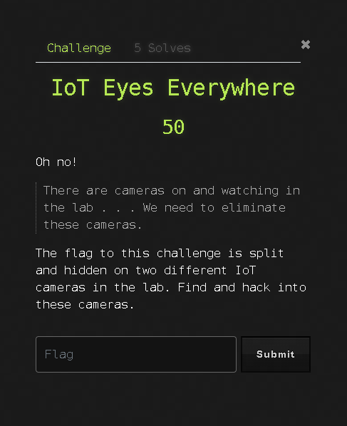

# CisoCTF
## CSUSB Capture the Flag

In infosec, capture the flag competitions are usually short term events with the goal of raising the tide so to speak.  These events are about colloborating with other people also interested in infosec and computer science.  In a typical capture the flag competition challenges are designed to encompass a variety of different knowledge areas within infosec.  

The categories are usually something like:

- Web Hacking
- Binary Exploitation
- Reverse Engineering
- Forensics
- Cryptography
- General

As the (now former)president for CSUSB's own cybersecurity club(CISO) for the 2021-2022 year, I wanted to incoroporate this golden infosec tradition of capture the flags.  Although I wanted added a fews twists to what was eventually known as **CisoCTF**.

Instead of a short event, CisoCTF was going to be a semester long CTF.  I wanted to maximize the platforms potential for students to learn.  The goal of this CTF wasn't to declare a winning team but to allow project leaders at CSUSB to engage students. 

CisoCTF's catgories would not be the aforementioned categories but instead would be the student projects led year after year at CSUSB's infosec club.

## The Platform

**The home page also featured the project schedule and list of categories.**

`Project Schedule/Project categories`

`About page`

While the so-called platform we had built was largely built on top of CTFd we added functionality not built-in to CTFd making it something new entirely.  While an about page as show above is nothing new, we generated custom pages for each student led project.  These custom pages would allow students to sign in and get relevant information about the project itself as demonstrated below.

`Hacking the Matrix, my own ethical hacking student project.`

### The Challenges
`Challenge Roster`

The challenge listing, in a normal CTF this is most likely where the competitors are going to spend the majority of their time.  In CisoCTF however the stress was **not** on the race to solve these challenges.  

The challenges represented a vehicle for the project leaders instruction.  It was meant to accelerate student learning by immedietly providing something hands on to demonstrate theory.  In the challenge above its showcasing using Nmap, a network vulnerability scanner.

`Challenge Breakdown by Category/Project`

### Fun Challenges from CisoCTF
**IOT Eyes Everywhere**

IOT Eyes Everywhere is a challenge concerning the default network security of various purchasable internet connected cameras.  The flag was split into two pieces and hidden somewhere on the filesystem of two different cameras.  The two cameras required different steps to exploit and gain command execution.

***Git* gud...** 

Git gud is a challenge encouraging the usage of git history commands to see through commits over time.  Once students had a mastery of these commands or understand this principle they would noticed credentials commited on the first commit and then subsequently removed.

**Gotta Catch em all**

Gotta catch em all was inspired by a NCL forensics challenge.  The game_data.sav file is a backup/log of a running Nitendo pokemon game.  The students had to decipher the .sav file using a custom application.

### Impact

The immediate impact of a year long project like CisoCTF is unclear.  It is not easy to measure a student's learning because of CisoCTF or the fun they had with it.  However we do have some metrics to help us clear some things up.

We can see that with **89** users registered **58** teams were involved in some capacity.  We also see a total of **49** whopping challenges spread across different cyber domains!! 

**These domains included:**
- Cyber Collegiate Defense Competition(CCDC)
	- Blue team incident response
- Computer Biology
	- Computer Hardware
- Digital Forensics (*self explanatory*)
- Drone Squad
- Hacking the Matrix
	- Ethical hacking/Penetration testing
- Network Engineering
- Python
- Red Hat Linux
- VR/Gadgeteering

Overtime at the end of CisoCTF a solid cybersecurity career roadmap was established propelling student's academic pursuits in a variety of ways.