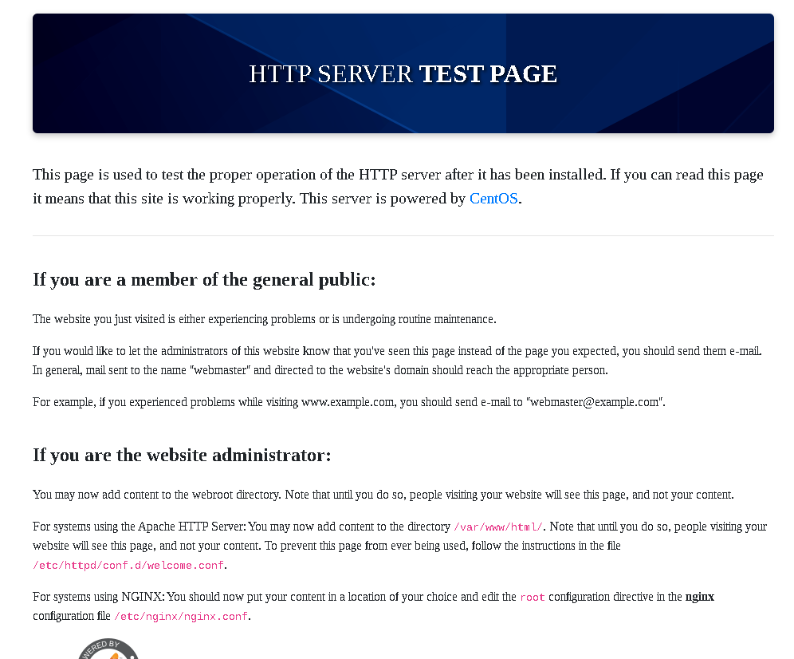
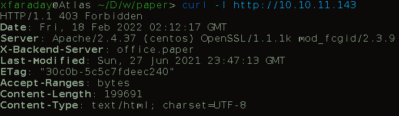
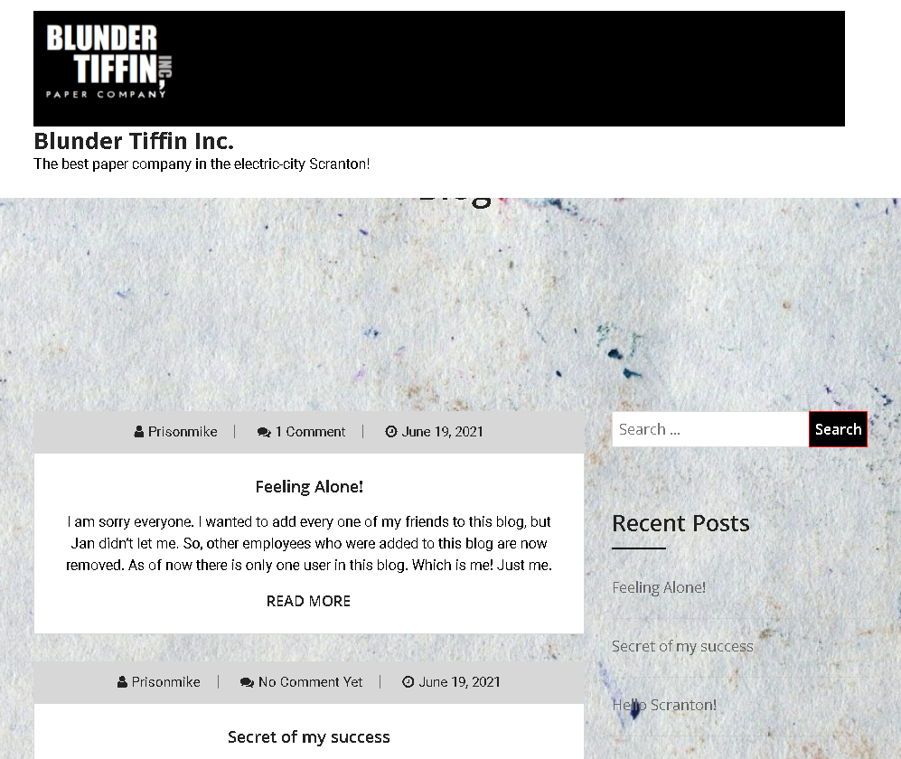
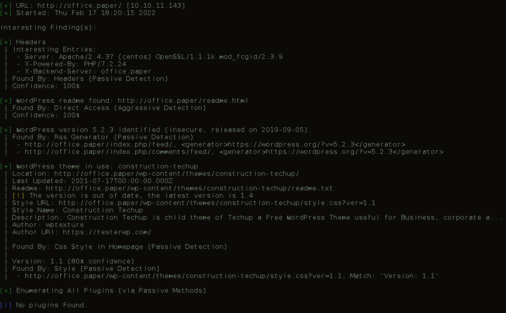
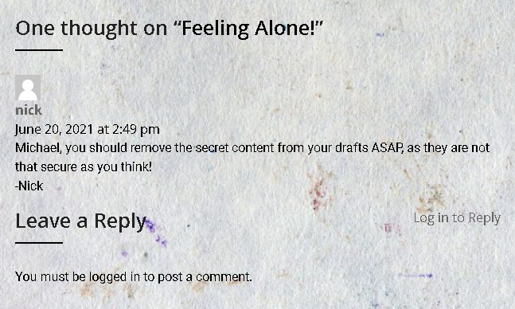
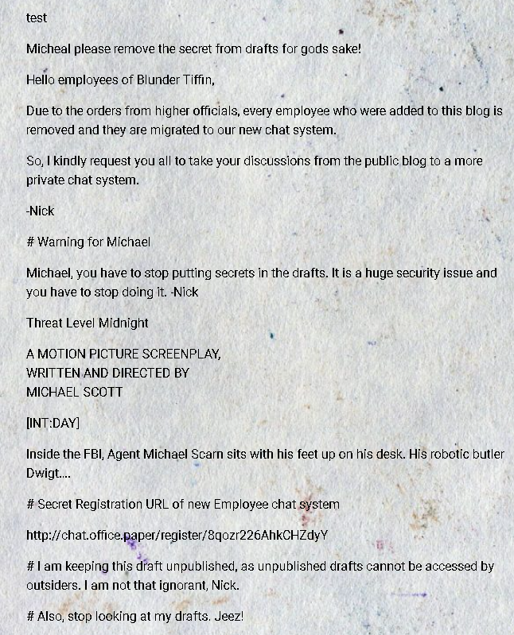
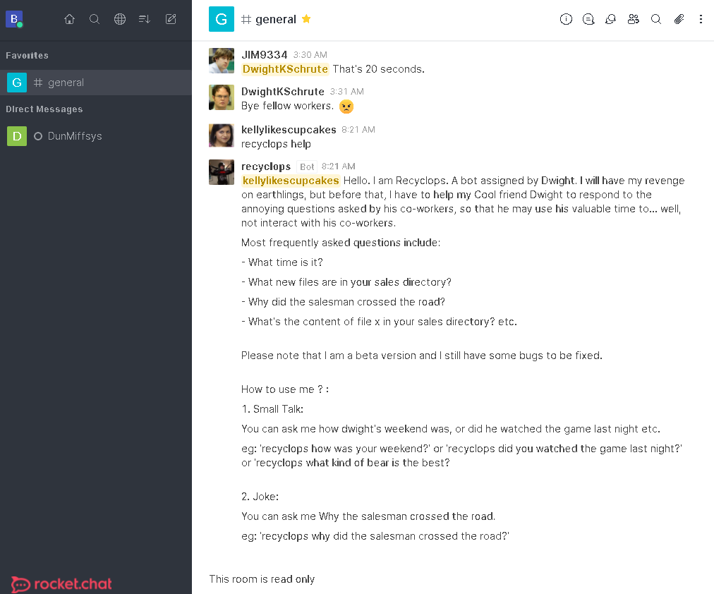
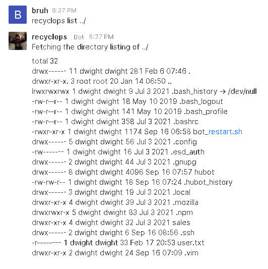
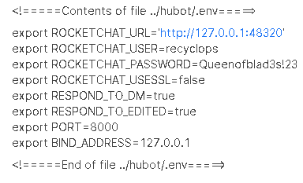
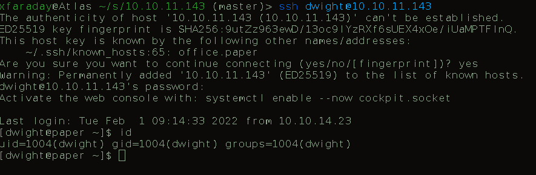

# Paper
## Hackthebox easy machine

## Nmap Scan

The Nmap `nmap -A` has revealed three services
1. 22 - SSH
2. 80 - HTTP
3. 443 - HTTPS

## Service Enum
### http
A default web page sadly, it doesnt seem to be of interest to us.  This page also applies for 443.

However upon closer inspection, a non standard server header stands out with some useful information
`curl -I http://10.10.11.143`

**X-Backend-Server: *office.paper***

A domain!  Lets add it to our /etc/hosts file and whazam!

### Wordpress

Lets start up our wpscan cuz we are lazy

`wpscan -e ap --url http://office.paper`

What's interesting here is the outdated version of wordpress, no plugins were found so our attack surface is limited.

Although a fellow employee on the blunder tiffin page suggested something we can take advantage of.

This version of wordpress is vulnerable to unathenticated viewing of wordpress drafts.

`searchsploit -x multiple/webapps/47690.md `

So far we know that adding `?static=1` to a wordpress URL should leak its secret content

Here are a few ways to manipulate the returned entries:

- `order` with `asc` or `desc`
- `orderby`
- `m` with `m=YYYY`, `m=YYYYMM` or `m=YYYYMMDD` date format

In this case, simply reversing the order of the returned elements suffices and `http://wordpress.local/?static=1&order=asc` will show the secret content:

**Nice** Lets try this POC!

New URL: http://office.paper/?static=1&order=desc

**A chat system...lets go over to it and register**

## Exploitation
### Rocket Chat

Not only do we have a delightfully funny chat system, it has a bot as well.  It also accepts sanitized shell commands...

After trying to fuzz the bot with several commands to break out of the limited control it appears it was well sanitized.

I tried
- `recyclops list ;id`
- `recyclops list $(id)`
- `recyclops list & id`

So I gave up on this attack path.  A more interesting one though is the source code located in the **/home/dwight/hubot** directory

Lets grab them secrets!
`recyclops file ../hubot/.env`

It's always nice to see some fresh creds 

**dwight:Queenofblad3s!23**

## PrivEsc
### Linpeas

The privilege esclation was polkit but unfortunately I did not document this process but you can read about it here.  I used this same guide to actually conduct the polkit exploitation process.

Polkit:
https://github.blog/2021-06-10-privilege-escalation-polkit-root-on-linux-with-bug/
